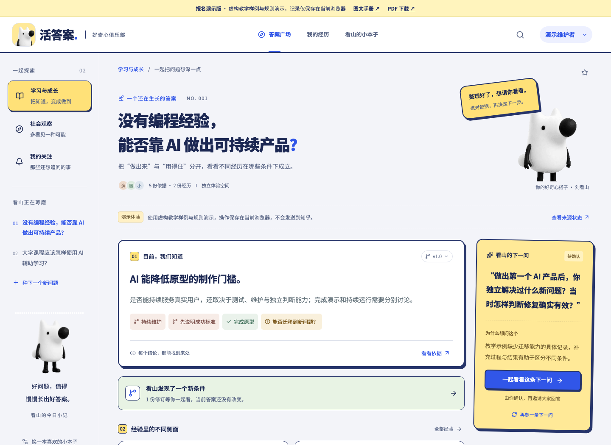
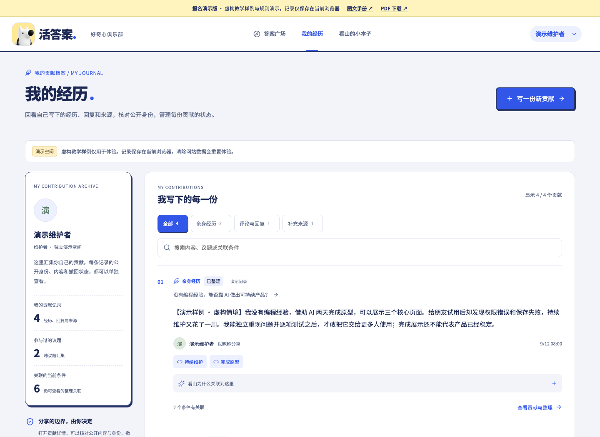
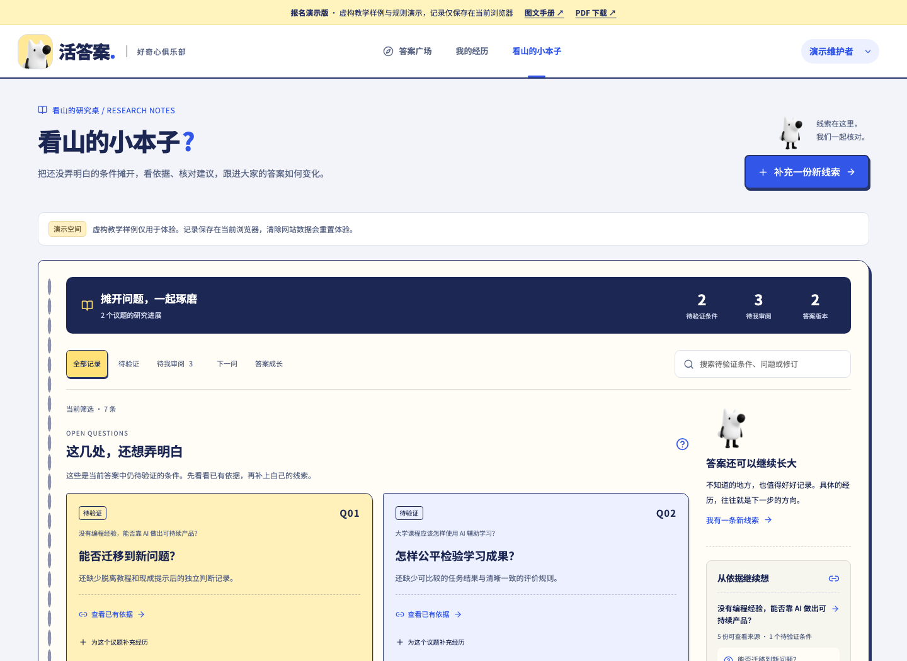
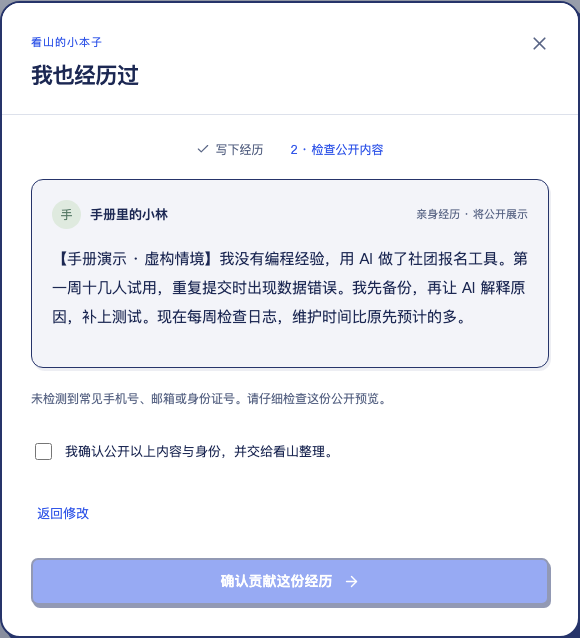
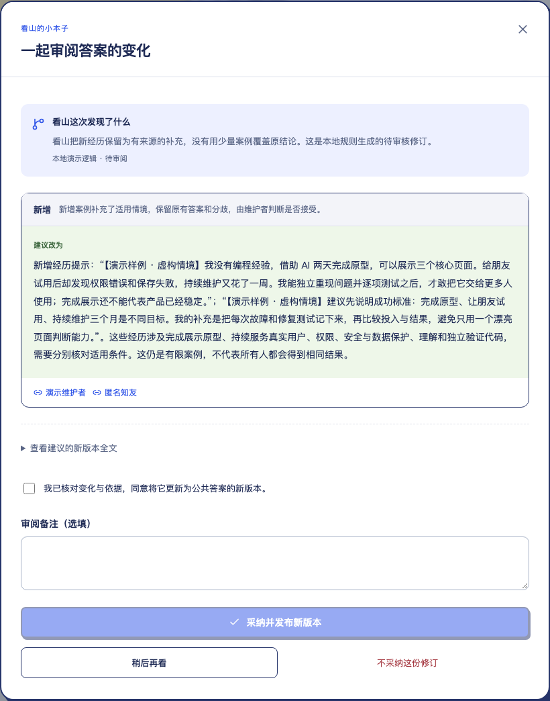

# 活答案 · 好奇心俱乐部

产品说明计划书 | 2026-09-14

在线演示：https://violetloveai.github.io/zhihu-live-answers/

代码与公开说明：https://github.com/violetloveAI/zhihu-live-answers

## 让答案随经历生长

活答案 · 好奇心俱乐部是一款面向知乎知识讨论的协作产品：把一份份经历整理成有适用条件、有来源、可追问、可修订的答案。

我们关注一个具体场景：当读者问“没有编程经验，能否靠 AI 做出可持续产品？”时，单一的“能”或“不能”都不够用。做出原型、解决真实需求、长期维护，是不同的问题。活答案让这些条件留在答案里，也让新的经历有机会改变旧结论。

服务三类参与者：读者看清答案适用范围；贡献者记录自己做过什么、在什么条件下奏效；维护者审阅依据和变化，决定哪些内容进入新版本。

**读者：少一点照搬结论。**读答案时一并看到适用条件、分歧与待验证之处。

**贡献者：让具体经历被用上。**经历与回复保留身份选择、来源和整理关系，可查看和撤回。

**维护者：把讨论变成积累。**从下一问、依据到修订差异与版本记录，逐步维护答案。

当前可公开体验的是 GitHub Pages 演示版：虚构教学样例、规则驱动的整理与回放、当前浏览器本地保存。真实模型接入的设计与联调进度见第 5、6 页。

图 1 · 答案广场：当前结论、适用条件与下一问。GitHub Pages 同版静态演示截图。

## 从分散的经历，到可检验的条件

核心价值是组织“答案为什么成立、还缺什么证据、下一步该问什么”，让社区参与持续改变答案。

教学情境：小周用 AI 两天做出社团报名原型，但在真实试用中遇到权限、重复提交和维护问题。这个经历支持“AI 降低原型门槛”，同时提醒“可持续使用仍需要测试与维护”。它应当改变答案的适用条件，而不只是成为评论区里又一段文字。

- **上下文容易丢失：**同一个“有效”，可能对应完全不同的经验、时间投入与验收标准。

- **新证据难以沉淀：**回复不断增加，读者仍需自己判断哪些结论过时、哪些例外重要。

- **流畅不等于可靠：**AI 摘要若省略来源与不确定性，容易把不同经历压成一句过度概括。

工作循环由五步组成：

- **贡献经历：**保留行动、条件、结果与来源

- **整理关联：**提出支持、例外与待验证条件

- **继续追问：**把证据缺口转成具体问题

- **人来确认：**审阅公开内容、来源与修订差异

- **形成新版本：**保留历史，让后续经历继续修正

**答案是一份可维护的对象。**正文与条件、证据、追问、版本共同存在，后续参与有明确落点。

**AI 围绕不确定性工作。**目标是发现缺口、建立关联、提出修订建议；不把未知包装成确定结论。

**人掌握公开与采纳权。**公开预览和修订审阅进入主流程，AI 建议不会自行覆盖当前答案。

上述是产品的 AI native 工作方式与接入目标。当前公开版使用可复现规则展示这一循环，不能据此宣称真实模型质量或真实社区效果已验证。

## 三张页面，三个清楚的任务

顶部导航切换独立页面。议题分类侧栏只出现在答案广场，个人经历和研究本子拥有各自的内容组织。

### 答案广场 · 读懂一个问题

查看当前答案、适用条件与依据；浏览贡献；跟进下一问与后续回复；打开答案成长记。可查找议题、关注议题，维护者可从候选来源建立新问题。

### 我的经历 · 管理我写过的内容

按经历、评论回复、补充来源筛选个人贡献，搜索记录，查看整理理由和关联条件。详情支持撤回或删除自己的内容；公开身份在提交前选择。

### 看山的小本子 · 推进还没弄明白的事

集中展示待验证条件、下一问、答案版本与来源。维护者可审阅追问与修订；其他贡献者查看允许公开的进展、补充经历。

角色与权限：

- **游客：**浏览公开答案与依据；开始贡献时进入演示身份选择。

- **演示贡献者：**提交并管理自己的经历、回复与来源；查看公开研究进展。

- **演示维护者：**具备贡献能力，并可审阅追问和修订、建立议题、处理内容反馈。

演示身份只用于体验权限差异，不等于真实知乎登录。两种角色进入各自的独立演示空间，不共享协作数据。

图 2 · 我的经历：个人贡献日志与管理。GitHub Pages 同版静态演示截图。

图 3 · 看山的小本子：待验证条件与研究进度。GitHub Pages 同版静态演示截图。

## 评委可跟做的 3 分钟体验

打开在线演示，从“开始体验”或“加入我们”进入，点击“和看山体验完整流程”，进入维护者演示空间。先看预置样例，再留下一份合成经历。耗时为建议分配。

- **00:00 - 00:25：**看条件 在答案广场打开 AI 产品议题，点击适用条件或“看看依据”，核对结论和来源。

- **00:25 - 01:05：**写经历并确认 点“我的经历”里的“写一份新贡献”，写下行动、结果与限制；选择公开身份，检查预览并确认提交。

- **01:05 - 01:25：**看整理关系 在个人贡献日志查看新增记录，展开“看山为什么关联到这里”，再打开贡献详情核对关系。

- **01:25 - 02:05：**审阅下一问 到“看山的小本子”筛选“待我审阅”，打开样例下一问，核对问题、依据与公开预览后确认；在应用内讨论留下一条回复。

- **02:05 - 02:40：**采纳一次修订 打开预置的样例答案修订，查看修改前后和引用依据；确认后采纳，观察当前答案与成长记中的新版本。

- **02:40 - 03:00：**验证用户控制权 回到“我的经历”查看自己的贡献管理入口；也可刷新页面确认当前浏览器保存了操作。

可输入的合成经历：我用 AI 为社团做了报名原型，两天跑通了表单。十位同学试用后发现重复提交问题，我增加校验并手动复测。原型能工作，但持续维护仍需有人负责。

追问只进入本应用内讨论，不会发送到知乎。示例流程采纳的是预置样例修订，不声称它由刚刚输入的回复生成；可另从依据面板选择证据，体验生成新修订建议。

图 4 · 提交前的公开预览。本地服务版规则回放截图。

图 5 · 审阅预置样例修订的差异与依据。本地服务版规则回放截图。

## 体验先成立，接入按证据推进

产品保留相同的主要界面与交互约定，公开演示和本地服务采用不同的数据执行路径。

### 当前公开演示

Next.js 静态页面 → 浏览器请求适配 → 虚构种子与确定性规则 → localStorage

支持贡献、预览、追问回复、修订、版本和权限演示。无需评委登录外部平台；刷新保留当前空间，清除网站数据会重置，不跨设备同步。

### 本地服务与接入设计

React / Next.js → 服务端 API 与权限校验 → 业务服务 / 存储 / 任务处理 → 知乎与模型适配器

已有服务端逻辑和独立接口联调；真实模型完整业务链、真实身份及共享多用户运行效果仍需继续验收。接口凭据留在服务端。

- **知乎搜索 / 热榜：**发现议题和候选依据，保留来源链接及时间状态。 9/14 独立调用均成功；公开版仍为样例。

- **直答模型：**经历与条件关联、下一问、结构化修订建议。 9/14 关联分析单次通过；追问和修订未全通过。

- **OAuth / 用户身份：**后续真实身份与授权范围内的个人体验。 官方推荐使用；当前未完成真实登录联调。

- **圈子与社区发布：**本次以应用内讨论承接追问和回复。 本次赛事无圈子能力；无自动远程发布。

接入不只判断 HTTP 是否成功：模型输出还需通过结构与引用检查；采纳前核对基础版本和来源可用性。链接存在不代表其内容已验证，来源失效和证据不足都应被明确展示。

## 已做到哪里，证据就写到哪里

目前已完成可操作的公开演示与本地服务实现，外部模型链路正在联调。以下区分用户能体验的结果和独立接口测试。

- 三个独立页面、个人贡献筛选与管理、待验证条件、依据查看、追问预览与绑定回复、修订审阅与版本历史。

- 公开内容确认、常见敏感格式遮挡、身份选择、角色和所有权检查、撤回删除后可见内容处理。自动遮挡仍需用户复核，不能承诺识别所有隐私。

- 静态公开链接、桌面与 390px 布局、图文手册及 PDF；浏览器刷新可继续当前演示空间。

- **公开演示 · 9/12：**静态构建及 TypeScript 检查通过；74 次浏览器运行时调用检查通过，0 次外部 fetch。 验证规则演示的稳定性，不代表模型或真实多人服务质量。

- **真实页面 · 9/12：**本地子路径与公网各执行完整 UI 流程，含新增贡献、绑定回复、v2 历史、撤回删除和 390px 布局。 三页公网直达正常，初始检查 0 页面错误、0 /api 请求。

- **公网复核 · 9/14：**公开演示全流程 10 组检查通过。 验证当前公开版交互；首屏性能另行检查，不由此推断加载速度。

- **知乎公共接口 · 9/14：**搜索 1 条成功（648ms）；热榜 1 条成功（182ms）。 独立合成测试请求，仅证明本轮接口可用。

- **真实模型 · 9/14：**经历关联分析单次通过（3405ms，1 个关联）；追问返回无效内容 JSON；修订请求被限流。 完整真实模型业务链未通过；网页仍运行规则演示。

尚未验证真实知乎 OAuth、跨用户共享协作、自动社区发布及完整模型闭环。当前没有可宣称的真实用户规模、留存率、模型准确率或社区改善效果。

## 下一步，把可追溯的讨论做扎实

迭代以“真实完成一次有依据的答案更新”为验收目标，先解决接入可靠性，再扩大参与范围。

- **P0 · 真实模型闭环：**排查追问结构化结果与限流，补齐经历分析 → 下一问 → 回复 → 修订的真实链路。 同一合成场景端到端通过；保留失败记录、引用校验和人工确认，不将降级结果标为真实生成。

- **P1 · 小范围真实协作：**验证服务端工作区、真实身份方案、存储和角色权限，邀请少量参与者使用指定议题。 不同用户的操作符合授权；来源、修订、撤回和历史之间的关系可复核。

- **P2 · 评估场景价值：**围绕“读懂适用条件”和“新经历能否修正答案”做任务观察。 记录找到依据的时间、待验证条件闭合情况、建议采纳及驳回原因。先建立基线，再确定改进目标。

活答案希望把知乎式的具体经验与 AI 的结构化整理结合起来：让好回答不仅被看见，也能随着新证据继续变好。评委今天可以验证完整交互与控制机制，真实模型和社区效果将以独立证据继续补齐。

- 界面图 1 - 3：2026-09-12 GitHub Pages 同版静态演示的实际截图，来自独立虚构空间；未使用真实用户资料。

- 界面图 4 - 5：2026-09-12 本地服务版的规则回放界面。它们展示公开预览与预置样例修订，和公开演示共用主要界面。

- 验证依据：项目内 docs/verification/github-pages.md、interface-manual.md；9/14 独立真实接口重测及公开脱敏记录。不同截图对应不同操作步骤，数量可随操作变化。

- 赛事接入说明：9/14 实读官方参赛流程指南与规则，并结合主办方已确认的“本次无圈子能力”。OAuth 为推荐接入，不作为本作品已完成能力陈述。

## 相关入口

- [在线演示](https://violetloveai.github.io/zhihu-live-answers/)
- [界面图文手册](https://violetloveai.github.io/zhihu-live-answers/manual/index.html)
- [界面 PDF 手册](https://violetloveai.github.io/zhihu-live-answers/manual/manual.pdf)
- [产品说明计划书](https://violetloveai.github.io/zhihu-live-answers/submission/index.html)
- [源代码](https://github.com/violetloveAI/zhihu-live-answers)
